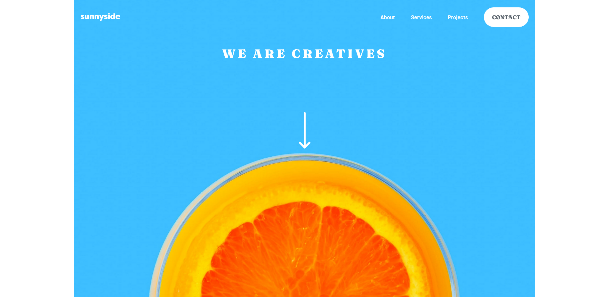

# Frontend Mentor - Sunnyside agency landing page solution

This is a solution to the [Sunnyside agency landing page challenge on Frontend Mentor](https://www.frontendmentor.io/challenges/sunnyside-agency-landing-page-7yVs3B6ef). Frontend Mentor challenges help you improve your coding skills by building realistic projects.

## Table of contents

- [Overview](#overview)
  - [The challenge](#the-challenge)
  - [Screenshot](#screenshot)
  - [Links](#links)
  - [Built with](#built-with)
  - [What I learned](#what-i-learned)
  - [Continued development](#continued-development)
  - [Author](#author)

### Overview
This is a complete landing page for a Sunnyside company. It consists of a large hero section with a navigation bar, a couple of sections below and a footer.
The whole page was built with a mobile-first approach, and it is completely responsive to all screen sizes.

### The challenge

Users should be able to:

- View the optimal layout for the site depending on their device's screen size
- See hover states for all interactive elements on the page

### Screenshot

### Links

- Live Site URL: https://d8701a.github.io/sunnyside-landingpage/

### Built with

- Semantic HTML5 markup
- CSS custom properties
- Flexbox
- CSS Grid
- Mobile-first workflow
- Javascript

### What I learned

I realized that having max-width: 100% on images set globally can cause some problems, therefore I will avoid setting it as a global property and maybe scope it locally instead.
Also I spent some time thinking how to solve the problem with the image section, and finally came up with the solution of having a subgrid (a grid within a grid). It worked perfectly!

I think hamburger menu could've been more elegant, so the next time I will try to use transitions to have it appear more smoothly, but I set its width dynamically using the clamp() function so it
changes its width depending on a screen size, which I'm very pleased with.

Also I am very happy with the possibilities of the <picture> element, as it definitely helps responsiveness via its adaptability and possibility to change the picture depending on a screen width.
This also helps users who are on a limited plan/bandwidth, as it avoids large images being unnecessarily downloaded and spending more data than needed.

### Continued development

I will definitely try to find ways to make hamburger menu transitions look smooth and more elegant. Also next time I will use two icons for the hamburger menu, one with three bars
and one with X, so the hamburger icon changes accordingly.

Also I am wondering if event propagation could've been used in the code when I wanted the menu to disappear when a user clicks anywhere outside the menu container.
I found my own solution that works, but for the future, I should look up the event propagation too.

## Author

- Frontend Mentor - [@d8701a](https://www.frontendmentor.io/profile/d8701a)

